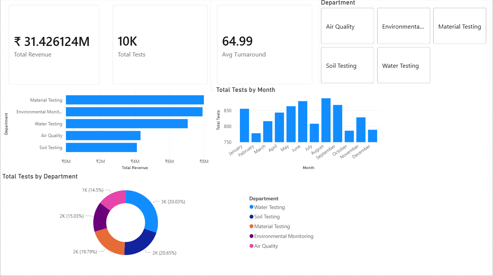
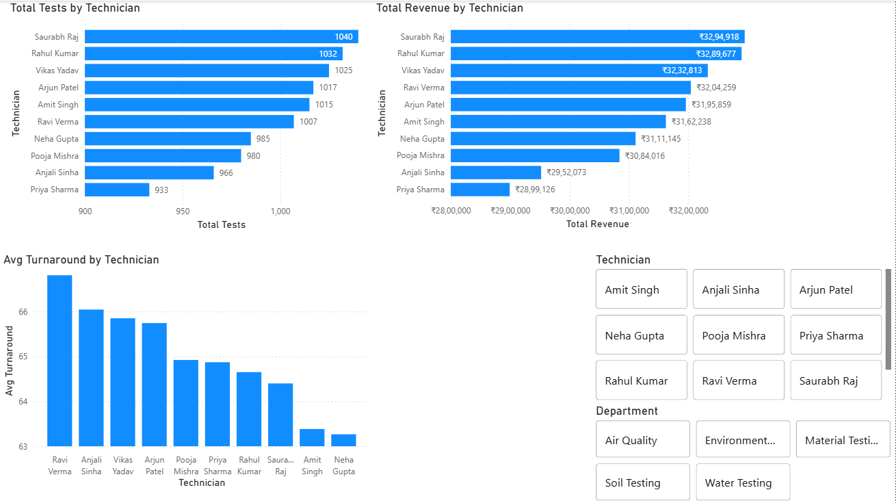
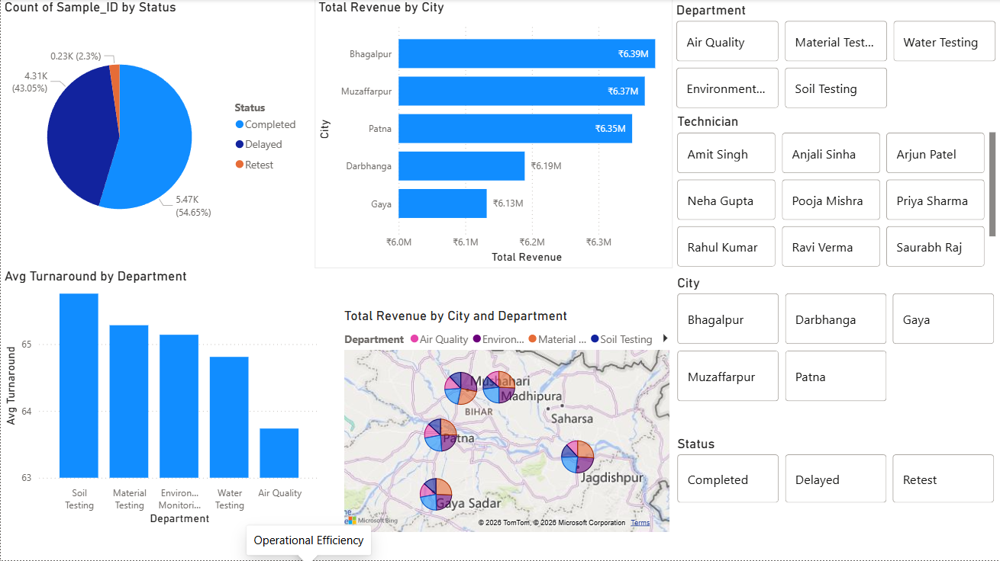

# **Laboratory Operations Analytics Dashboard**

## **Project Overview**

This project demonstrates an end-to-end Data Analytics workflow using Python, MySQL, and Power BI. The objective was to analyze laboratory operations data and build an interactive dashboard for monitoring operational efficiency, revenue performance, technician productivity, and testing turnaround times.

The project simulates a real-world laboratory environment handling environmental, water, soil, air quality, and material testing operations.

---

## **Business Problem**

Laboratories process thousands of testing requests every year. Monitoring operational performance manually can make it difficult to identify delays, measure productivity, and evaluate revenue generation across departments.

This dashboard was developed to provide stakeholders with a centralized view of:

* Testing volume  
* Revenue performance  
* Technician productivity  
* Department-wise performance  
* Turnaround times  
* Delayed test reports

---

## **Tools & Technologies**

* Python  
* Pandas  
* NumPy  
* Faker  
* MySQL  
* SQL  
* Power BI  
* DAX

---

## **Dataset**

A synthetic dataset containing 10,000+ laboratory testing records was generated using Python.

### **Dataset Fields**

| Column | Description |
| ----- | ----- |
| Sample\_ID | Unique laboratory sample identifier |
| Test\_Date | Date of test execution |
| Department | Testing department |
| Technician | Assigned technician |
| Test\_Type | Type of laboratory test |
| Turnaround\_Hours | Time taken to complete the test |
| Status | Completed, Delayed, or Retest |
| Revenue | Revenue generated from the test |
| Client\_Type | Government, Private Industry, Individual, NGO |
| City | Location of testing activity |

---

## **Project Workflow**

Python Data Generation  
↓  
CSV Dataset Creation  
↓  
MySQL Data Storage  
↓  
SQL Data Analysis  
↓  
Power BI Dashboard Development  
↓  
Business Insights & KPI Reporting

---

## **Key Performance Indicators (KPIs)**

* Total Revenue  
* Total Tests Conducted  
* Average Turnaround Time  
* Delayed Test Percentage  
* Revenue by Department  
* Technician Productivity  
* Revenue by City  
* Department Performance Analysis

---

## **Dashboard Pages**

### **Executive Overview**

* Total Revenue  
* Total Tests Conducted  
* Average Turnaround Time  
* Delay Percentage  
* Monthly Revenue Trend  
* Revenue by Department  
* Test Distribution by Department

### **Technician Analytics**

* Tests Completed by Technician  
* Revenue Generated by Technician  
* Average Turnaround Time by Technician  
* Technician Performance Ranking

### **Operational Efficiency**

* Status Distribution  
* Department-wise Turnaround Analysis  
* Revenue by City  
* Operational Bottleneck Identification

---

## **SQL Analysis Performed**

### **Revenue Analysis**

* Total Revenue Generated  
* Revenue by Department  
* Monthly Revenue Trends

### **Productivity Analysis**

* Technician Performance Ranking  
* Test Volume Analysis

### **Operational Analysis**

* Average Turnaround Time  
* Delayed Test Percentage  
* Department Efficiency Comparison

---

## **Key Insights**

* Identified departments contributing the highest revenue.  
* Analyzed technician productivity across multiple testing categories.  
* Monitored testing delays and operational bottlenecks.  
* Evaluated turnaround performance to support process improvement initiatives.  
* Developed interactive dashboards enabling data-driven decision making.

---

## 

## 

## 

## 

## **Repository Structure**

Laboratory-Operations-Analytics/  
│  
├── data/  
│   └── laboratory\_operations\_dataset.csv  
│  
├── sql/  
│   └── analysis\_queries.sql  
│  
├── dashboard/  
│   └── Laboratory\_Operations\_Analytics.pbix  
│  
├── screenshots/  
│   ├── executive\_overview.png  
│   ├── technician\_analytics.png  
│   └── operational\_efficiency.png  
│  
└── README.md

---

## **Skills Demonstrated**

* Data Cleaning  
* Data Analysis  
* SQL Querying  
* Database Management  
* KPI Development  
* Data Visualization  
* Dashboard Design  
* Business Intelligence  
* Problem Solving  
* Stakeholder Reporting

---

## **Future Improvements**

* Predictive analysis for test volume forecasting  
* Revenue forecasting using time-series models  
* Automated ETL pipeline development  
* Real-time dashboard integration  
* Machine learning models for delay prediction

* ## Dashboard Preview

### Executive Overview

### Technician Analytics

### Operational Efficiency

---

## **Author**

Prakhar Priy Raj

LinkedIn: [https://www.linkedin.com/in/prakhar-priyraj/](https://www.linkedin.com/in/prakhar-priyraj/)
